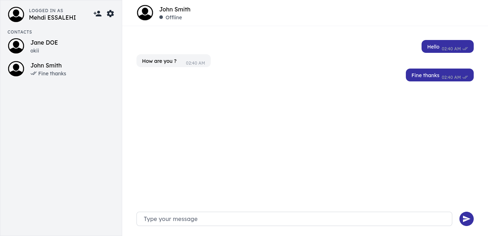

# Messaginger

A backend implementation for an instant messaging app.

## Tech used
- **Backend:** Node.js/Express
- **Frontend:** React (Separate repository)
- **Database:** MongoDB

## Features
- [x] Basic texting
- [x] Invite system
- [ ] End-to-End encryption
- [x] Inline maths support
- [ ] Images & videos
- [ ] Documents
- [ ] Audio
- [ ] Text formatting support
